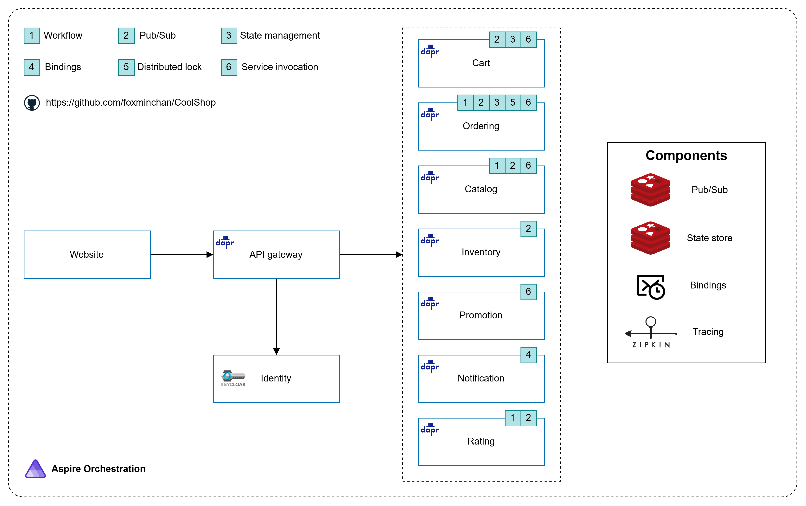

# CoolShop Application

<p align="justify">
This demo showcases an e-commerce application built using several microservices based on .NET Core, running on Dapr. It illustrates how to integrate small, independent microservices into a larger system, following microservice architectural principles.
</p>

<div>
  <a href="https://codespaces.new/foxminchan/CoolShop?quickstart=1">
    
  </a>
</div>

## Pre-requisites to Run the Application

- A device with an Nvidia GPU
- [Install & start Docker Desktop](https://www.docker.com/products/docker-desktop)
- [Install .NET 8.0 SDK](https://dotnet.microsoft.com/download/dotnet/8.0) or later, and [Visual Studio 2022](https://visualstudio.microsoft.com/downloads/)
- [Install Dapr CLI](https://docs.dapr.io/getting-started/install-dapr-cli/)
- [Install Node.js](https://nodejs.org/en/download/)
- [Install Python 3.12.5](https://www.python.org/downloads/release/python-3125/)

## Architecture Overview



<p align="justify">
The CoolShop application, as depicted in the diagram, is built with .NET Core and Dapr, an event-driven runtime that simplifies the development of resilient microservice applications. It consists of the following microservices:
</p>

<p align="justify">

- The API gateway abstracts the client from the underlying microservices, providing a single entry point for all requests. ItIt's implemented using [Krakend](https://www.krakend.io/), a stateless, distributed, high-performance API Gateway that helps you effortlessly adopt microservices.
- For identity management, the application uses the [Keycloak](https://www.keycloak.org/) identity and access management solution. Keycloak provides a single sign-on solution for all your applications, allowing you to secure your applications and services with minimum effort.
- The set of core backend microservices includes functionality required for an eCommerce store. Each is self-contained and independent of the others. The services include:
  - The catalog service manages the products available in the store.
  - The cart service manages the shopping cart for each user.
  - The order service manages the orders placed by users.
  - The inventory service manages the stock levels of products.
  - The promotion service manages the promotions available in the store.
  - The notification service sends notifications to users.
  - The rating service manages the ratings and reviews of products.
- Each service integrates elements of [Clean Architecture](https://jasontaylor.dev/clean-architecture-getting-started/), [Vertical Slice Architecture](https://www.jimmybogard.com/vertical-slice-architecture/), and [Hexagonal Architecture](https://netflixtechblog.com/ready-for-changes-with-hexagonal-architecture-b315ec967749), resulting in a clean, maintainable, and testable codebase. I implemented various frameworks for developing services, such as [.NET Core](https://dotnet.microsoft.com/), [NestJS](https://nestjs.com/), and [FastAPI](https://fastapi.tiangolo.com/).
- Additionally, the application integrates an LLM (Large Language Model) for semantic search and chatbot functionality. The LLM is built with [Ollama](https://ollama.com/) and utilizes RAG (Retrieval-Augmented Generation) to enhance retrieval and response generation **_[This feature is under development]_**.

</p>

## Running the Application

1. Clone the repository:

```bash
git clone https://github.com/foxminchan/CoolShop
cd CoolShop
```

2. Start Dapr:

```bash
dapr uninstall --all && dapr init
```

3. Install dependencies:

```bash
make run
```

4. Run the following command to set the user secrets for the `CoolShop.AppHost` project

```bash
dotnet user-secrets set "keycloak-username" "your-username"
dotnet user-secrets set "keycloak-password" "your-password"
dotnet user-secrets set "postgres-user" "postgres"
dotnet user-secrets set "postgres-password" "your-password"
```

5. Start the application:

```bash
dotnet run --project ./src/CoolShop.AppHost/CoolShop.AppHost.csproj
```

> [!WARNING]
> Docker Desktop must be running before starting the application.

## Support

If you like this project, please consider supporting it by starring ⭐ and sharing it with your friends!

## Project References & Credits

- [eShopOnDapr](https://github.com/dotnet-architecture/eShopOnDapr)
- [eShopSupport](https://github.com/dotnet/eShopSupport)

## License

This project is licensed under the MIT License - see the [LICENSE](LICENSE) file for details.
